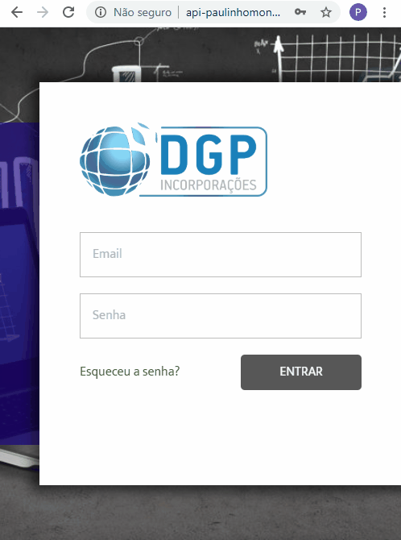

# DGP Manager System - Sistema para Gestão de Urbanizadoras (SaaS)
> Status do Projeto: Em desenvolvimento :warning:

Mini-ERP, abrangendo a gestão (CRUD) de CLIENTES, EMPREENDIMENTOS, LOTES, COTAS, CONTAS (MOVIMENTAÇÃO), FLUXO DE CAIXA E AGENDA DE COMPROMISSOS. Versão atual contempla o módulo de CLIENTES totalmente funcional.

# Recursos para utilização

Hospedagem NODEJS ou mesmo em LOCALHOST, através do comando: NODE APP. Base de dados MySQL. Script disponível no projeto.

Backend desenvolvido em NodeJS, renderizando templates EJS, com CSS Tailwind (https://tailwindcss.com/) e framework Javascript AlpineJS (https://github.com/alpinejs/alpine).

Tailwind e AlpineJS são  referenciados no HTML, através da tag <link> e <script> e já estão configuradas nos templates EJS.
  
O modelo lógico já provê a API com endpoints para integrações REST.
  
# Deploy da Aplicação com Umbler: :dash:

> http://api-paulinhomonteiro-com.umbler.net/
> user: monteiro@gmail.com
> pass: 12345

# Screenshots

# Recursos e Tecnologias utilizadas

- [x] NodeJS

- [x] Express

- [x] CORS

- [x] EJS

- [x] dotenv-safe

- [x] JSON Web Token (JWT)

- [x] Tailwind CSS

- [x] Datatables.JS

- [x] Alpine JS

- [x] Window.localStorage

- [x] Express Static Path (Servindo arquivos estáticos pela API)

- [x] MySQL Database

- [x] JQuery

Made with too much ♥ by [Paulinho Monteiro] (http://www.paulinhomonteiro.com)
