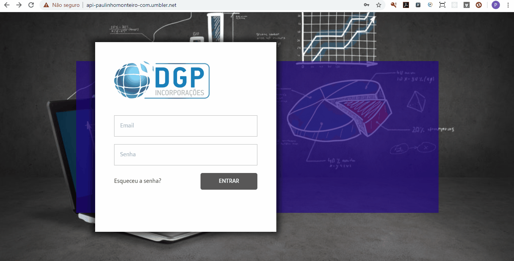

# DGP Manager System - Sistema para Gestão de Urbanizadoras (SaaS) 

Mini-ERP, abrangendo a gestão (CRUD) de CLIENTES, EMPREENDIMENTOS, LOTES, COTAS, CONTAS (MOVIMENTAÇÃO), FLUXO DE CAIXA E AGENDA DE COMPROMISSOS. Versão atual contempla o módulo de CLIENTES totalmente funcional.

> Status do Projeto: Em desenvolvimento :warning:

# Recursos

Hospedagem NODEJS ou mesmo em LOCALHOST, através do comando: NODE APP. Base de dados MySQL. O Script para criação da base está disponível no projeto.

Backend desenvolvido em NodeJS, renderizando templates EJS, com CSS Tailwind (https://tailwindcss.com/) e framework Javascript AlpineJS (https://github.com/alpinejs/alpine).

Tailwind e AlpineJS são  referenciados no HTML, através da tag ```<link>``` e ```<script>``` e já estão configuradas nos templates EJS.
  
O modelo lógico já provê a API com endpoints para integrações REST.
  
# Screenshots



# Tecnologias

- [x] NodeJS

- [x] Express

- [x] CORS

- [x] EJS

- [x] dotenv-safe

- [x] JSON Web Token (JWT)

- [x] Tailwind CSS

- [x] Datatables.JS

- [x] Alpine JS

- [x] Window.localStorage

- [x] Express Static Path (Servindo arquivos estáticos pela API)

- [x] MySQL Database

- [x] JQuery

- [x] Mobile First

- [x] Umbler Host

<hr />

Made with too much ♥, by [Paulinho Monteiro] (http://www.paulinhomonteiro.com) - 2020.
